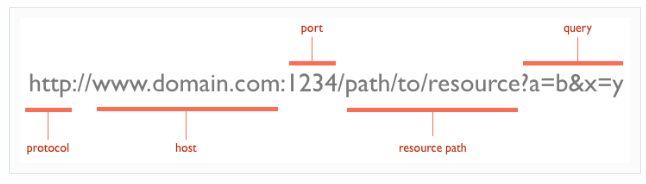

# HTTP
* stand for 'HyperText Transfer Protocol'
## URL =>
* Stand For 'Uniform Resource Locators'
- componant for URl 

## verbs
* request verbs:
- GET :fetch an existing resource.
- POST :create a new resource.
- PUT : update an existing resource.
- DELETE :delete an existing resource. 
- HEAD: this is similar to GET, but without the message body.
- TRACE: used to retrieve the hops that a request takes to round trip from the server.
- OPTIONS: used to retrieve the server capabilities. 

## Status Codes
- 1xx : Informational Messages
- 2xx: Successful
- 3xx: Redirection
- 4xx: Client Error
- 5xx: Server Error

## Request and Response Message Formats
- Request => URL + verb
- Response => Message body + status code

## REST 
* Stand For ' REpresentational State Transfer '
> t is architectural style for **distributed hypermedia systems**
distributed hypermedia systems : provide middle-ware services for a range of hypertext applications. 

