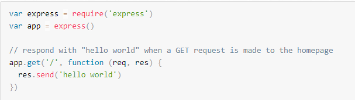
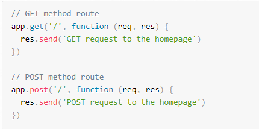

# Routing 
Routing refers to how an application’s endpoints (URIs) respond to client requests. For an introduction to routing, see Basic routing.
You define routing using methods of the Express app object that correspond to HTTP methods; for example, app.get() to handle GET requests and app.post to handle POST requests. For a full list, see app. METHOD. You can also use app.all() to handle all HTTP methods and app.use() to specify middleware as the callback function

# Route methods
A route method is derived from one of the HTTP methods, and is attached to an instance of the express class.

