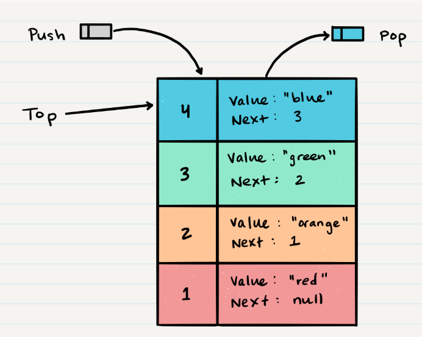
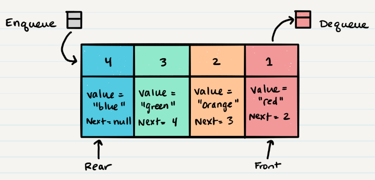

# What is a Stack ?
 A stack is a data structure that consists of Nodes. Each Node references the next Node in the stack, but does not reference its previous.

## terminology for a stack 

 - push => insert node into stack
 - pop => remove node from stack
 - peek => return the value for the top
 - isEmpty => return true when the stack empty

## FILO

> First In Last Out

 * This means that the first item added in the stack will be the last item popped out of the stack.

## LIFO

 >Last In First Out

 * This means that the last item added to the stack will be the first item popped out of the stack.

* Push O(1)
    - steps to do push
    1. make new node need to add
    2. make the top to a new node

* pop o(1)
    - steps to do pop
    1. make a temp pointer to the node need to deleted
    2. top point to prevus node 
    3. return the temp node

* peek o(1)

     * steps to do peek
     1. return the top of thee stack

* isEmpty o(1)

    return if the top = null

# What is a Queue

 > A stack is a data structure that consists of Nodes. 

## terminology for a queue

 1. Enqueue => add to queue
 2. Dequeue => remove from  queue
 3. Front => the first Node of the queue
 4. Rear=> the last Node of the queue
 5. Peek => view the front value
 6. IsEmpty => return true when the queue empty

## FIFO

> First In First Out

* This means that the first item in the queue will be the first item out of the queue.

## LILO

> Last In Last Out

* This means that the last item in the queue will be the last item out of the queue.

