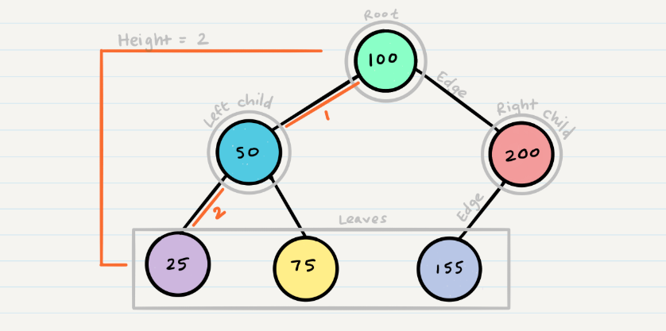

# Trees

# Common Terminology

* Node - A node is the individual item/data that makes up the data structure
* Root - The root is the first/top Node in the tree
* Left Child - The node that is positioned to the left of a root or node
* Right Child - The node that is positioned to the right of a root or node
* Edge - The edge in a tree is the link between a parent and child node
* Leaf - A leaf is a node that does not contain any children
* Height - The height of a tree is determined by the number of edges from the root to the bottommost node

# here are two categories of traversals when it comes to trees:

* Depth First => using stack
* Breadth First => using queue

# Here are three methods for depth first traversal:

* Pre-order: root >> left >> right
* In-order: left >> root >> right
* Post-order: left >> right >> root

* Breadth First

Breadth first traversal iterates through the tree by going through each level of the tree node-by-node. So, given our starting tree one more time

# Binary Trees

Trees can have any number of children per node, but Binary Trees restrict the number of children to two (hence our left and right children).

# Binary Search Trees

 is a type of tree that does have some structure attached to it. In a BST, nodes are organized in a manner where all values that are smaller than the root are placed to the left, and all values that are larger than the root are placed to the right.
 
 
